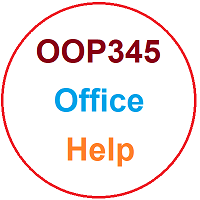

# OOP345 NBB Notes

## Online Lectures

You can join as a guest to the lecture only with your FULL NAME and using a microphone (NO LISTEN ONLY) by [clicking HERE for Oct 02](https://connect.rna2.blindsidenetworks.com/invite/to?c=nmR6XfRenFq8_zRfQaWUgUWLJC8r7cKqKpYrbta-e9A&m=01540574e3804e719f3f0958abac9d4166062c3d&t=1696261014647&u=senecacollege)

## Workshop Zero
As a student in my class, you must familiarize yourself with GitHub so you can share your daily work with me for advice/help, collaboration and monitoring of our progress. 

This is done using what I call Workshop Zero; through a series of videos instructing you on how to set up your computer to use GitHub effectively for collaboration.
 
Complete this workshop by September 12th.

> This workshop was originally created for my OOP244 students, but since the details are identical for both 244 and 345, I am not going to create a new one for OOP345. Therefore in the following playlist at any point when the subject or name `OOP244` is referred to, please replace it with `OOP345`!

Here are the Videos. The due date for [Workshop Zero](https://www.youtube.com/playlist?list=PLxB4x6RkylouixUhNXf0MuwccLriA0DGC) is Tuesday, September 12th.

https://www.youtube.com/playlist?list=PLxB4x6RkylouixUhNXf0MuwccLriA0DGC

> Note: As a computer science student you must learn to be precise and exact in your work. Please watch the videos, listen to the instructions carefully and follow the instructions EXACTLY as instructed. Especially the last step of the Workshop.

### Mac Users
Working on different platforms you are required to learn and work with Visual Studio as an advanced IDE, especially in future semesters. 
For Mac, either you have to do all the git commands through the command line and use XCode (which you can not use in future Windows-related subjects), or you need to install a Virtual Machine and run Windows on your Mac. This will have Windows running in a window on your Mac without losing your Mac Settings and features:
- [Install Fusion Vmware](https://www.vmware.com/ca/products/fusion/fusion-evaluation.html) Fusion is free for students; click on ["Register Lisence for Personal Use"](https://customerconnect.vmware.com/web/vmware/evalcenter?p=fusion-player-personal) 
- [Install Windows 10 on Fusion VM](https://www.groovypost.com/howto/create-custom-virtual-machine-vmware-fusion/)

### Lecture recordings
- [01-Sep8, Introduction](https://youtu.be/3kVSMVlA_Gg)
- [How to book an appointment with Fardad for Help or discussion](https://youtu.be/4pnVGeDpTck)
- [02- Sep 11 - typedef, static, how compiler works and syntax of main](https://recordings.rna2.blindsidenetworks.com/senecacollege/b3ba287a672f67483331c27b46a1916f1312da0c-1694446501659/capture/)
- [03- Sep15 - Static, Main Arguments, Reference Review, void pointers, lvalue and value](https://youtu.be/7McCW3caDYo?si=zLPULKce4t3C2Kac)
- [04-Sep18 -  pointer to pointers, main args, aggregate initialization, Unions, Auto, statics](https://youtu.be/BtMl2tKWpQA)
- [05-Sep22 - Review and Moving](https://youtu.be/SsW9jPf1rpc?si=NiLIDrhxKiTNNBai)
- [06-Sep25 - Review and templates](https://youtu.be/22B2cItgmeY)

# Office

For Help and office times, click on my  [Office](https://teams.microsoft.com/l/channel/19%3a1381ZsiY4b_W62-Jd3ipFIk-O77ae3qgi2LFgq7GgHg1%40thread.tacv2/General?groupId=d03b0a80-eead-4454-851c-5c1fe9428ba3&tenantId=eb34f74a-58e7-4a8b-9e59-433e4c412757)  link to go to MS Teams, then click on the calendar icon and book a meeting using **Scheduling Assistant** to make sure it does not have a conflict with my other work activities.

# Fardad's Schedule
| Period | Start-Stop  | Mon | Tue | Wed | Thu | Fri |
|--------|-------------|:-----------------:|:-----------------:|:-----------------:|:-----------------:|:-----------------:|
| 1      | 8:00-8:50   |   OOP244ZAA   Lecture: M300    |    |     |     |    |
| 2      | 8:55-9:45   |   OOP244ZAA   Lecture: M300     |    |     |    |     |
| 3      | 9:50-10:40  |     |      |     |  OOP244ZAAL   Lec/Lab: M512   |  OOP345NBBL   Lec/Lab: A3518    |
| 4      | 10:45-11:35 |     |   |     |  OOP244ZAAL   Lec/Lab: M512  | OOP345NBBL   Lec/Lab: A3518   |
| 5      | 11:40-12:30 |OOP345NBB   Lecture: BigBlueButton   |     | OOP244NAA   Lecture: E1419  |     |  OOP244NAAL   Lec/LAB: A3512  |
| 6      | 12:35-13:25 |OOP345NBB   Lecture: BigBlueButton   |      | OOP244NAA   Lecture: E1419   |   |  OOP244NAAL   Lec/LAB: A3512 |
| 7      | 13:30-14:20 |    |     |      |     |    |
| 8      | 14:25-15:15 |     |       |     |   |     |
| 9      | 15:20-16:10 |     |      |     |      |       |
| 10     | 16:15-17:05 |     |   |    |      |     |
| 11     | 17:10-18:00 |       |     |     |      |      |
| 12     | 18:05-18:55 |       |     |   |      |      |
